<p align="center">
  
</p>

# 🌌 Material Hardness & Oxidation Prediction  
### **AI-Driven Microstructure–Property Intelligence Platform for Materials Engineering**

<p align="center">
  
  
  
  
  
  
  
</p>

---

# 🌐 Live Deployment
Experience the fully deployed cloud version:  
👉 **https://material-hardness-oxidation-prediction.onrender.com**

---

# ⭐ Executive Summary
Material Hardness & Oxidation Prediction (**MHOC**) is a **research-grade materials engineering intelligence platform** that predicts mechanical and oxidation properties of Stellite-6 hardfaced ferrous alloys using ML + Explainable AI.

It integrates:

- High-fidelity ML regression models  
- SHAP-based explainability  
- Scientific microstructure–property theory  
- Full UI stack with Flask + Jinja  
- All diagnostics (EDA, performance, feature analysis)  
- Render cloud deployment  

---

# 🔬 Scientific Foundation
This system is grounded in the experimental paper:

👉 **https://iopscience.iop.org/article/10.1088/1757-899X/998/1/012061**

**“Experimental Studies of Stellite-6 Hardfaced Layer on Ferrous Materials by TIG Surfacing Process”**  
IOP Conf. Ser.: Materials Science & Engineering  
Vol. 998 (2020), 012061  
DOI: 10.1088/1757-899X/998/1/012061  

---

# 🏗 System Architecture

```
                   ┌───────────────────────────────-┐
                   │         Web UI (Flask)         │
                   │  Modern HTML • CSS • JS • Jinja│
                   └──────────────┬─────────────────┘
                                  │
                           Input Validation
                                  │
                   ┌──────────────▼──────────────┐
                   │      Inference Engine       │
                   │ Pydantic • Preprocessing    │
                   └──────────────┬──────────────┘
                                  │
       ┌──────────────────────────┼──────────────────────────┐
       ▼                          ▼                          ▼
┌──────────────┐       ┌────────────────┐       ┌────────────────────────┐
│ Hardness ML  │       │ Oxidation ML   │       │ Metadata & Versioning  │
│ LR + RF      │       │ Random Forest  │       │ JSON, checksums, logs  │
└───────┬──────┘       └──────┬────────-┘       └────────────┬──────────-┘
        │                     │                              │
        └──────────────┬──────┴──────────────┬──────────────-┘
                       ▼                     ▼
         ┌──────────────────────┐   ┌──────────────────────────┐
         │ SHAP Explainability  │   │ Performance Diagnostics  │
         │ Global + Local       │   │ Residuals • R² • MAE     │
         └──────────────────────┘   └──────────────────────────┘
```

---

# 🎨 UI Showcase  


### **Home Interface**
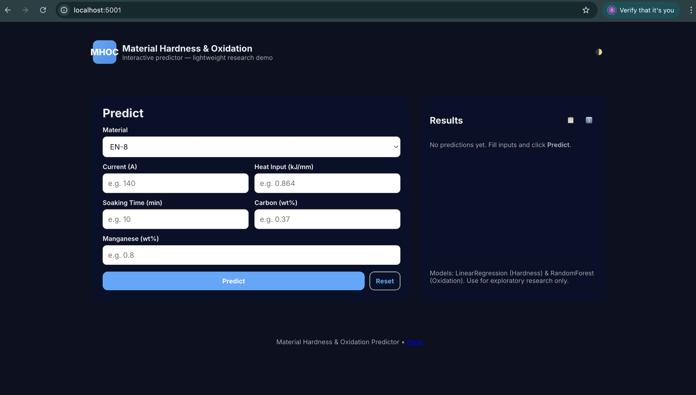

### **Prediction Workflow**
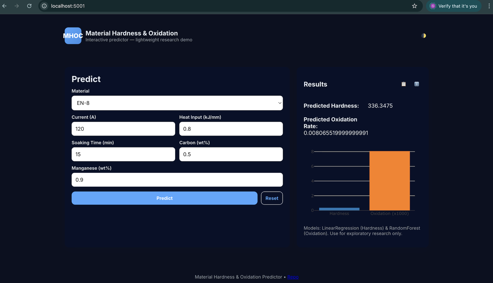

### **Hardness Explainability (SHAP)**
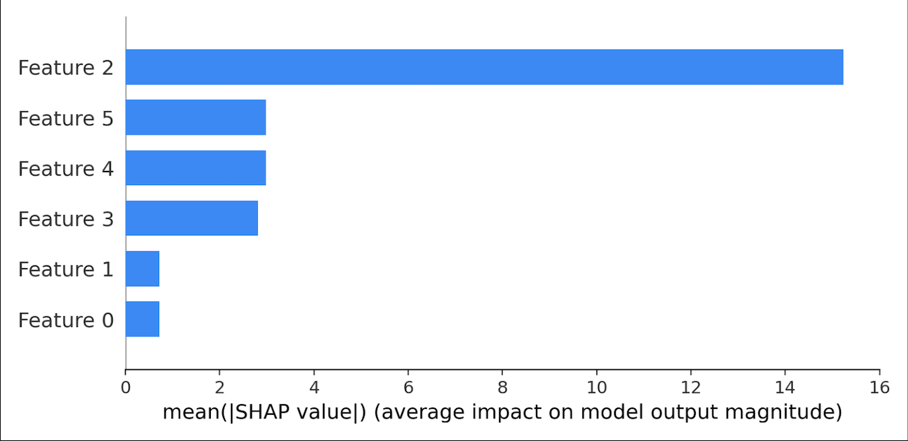

### **Oxidation Explainability (SHAP)**
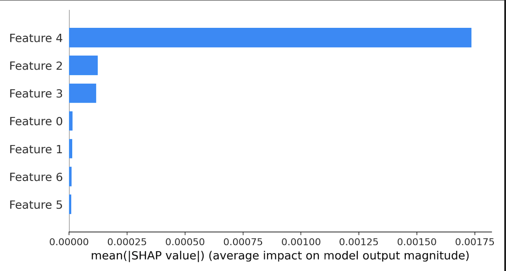


---

# 📊 Exploratory Data Analysis  

<details>
<summary><strong>Expand EDA Visualizations</strong></summary>

### Hardness Dataset
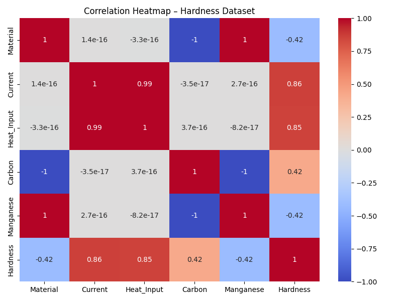
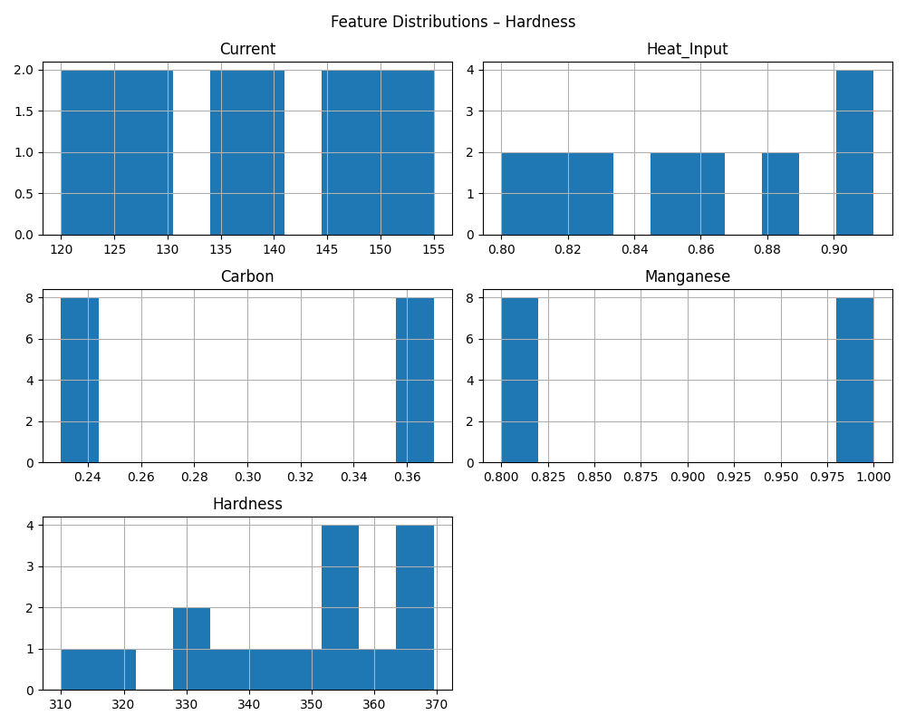

### Oxidation Dataset
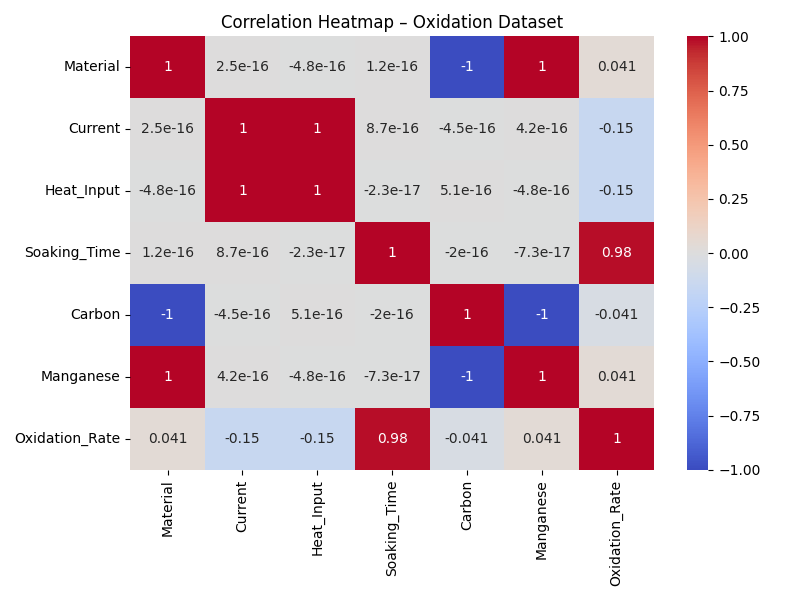
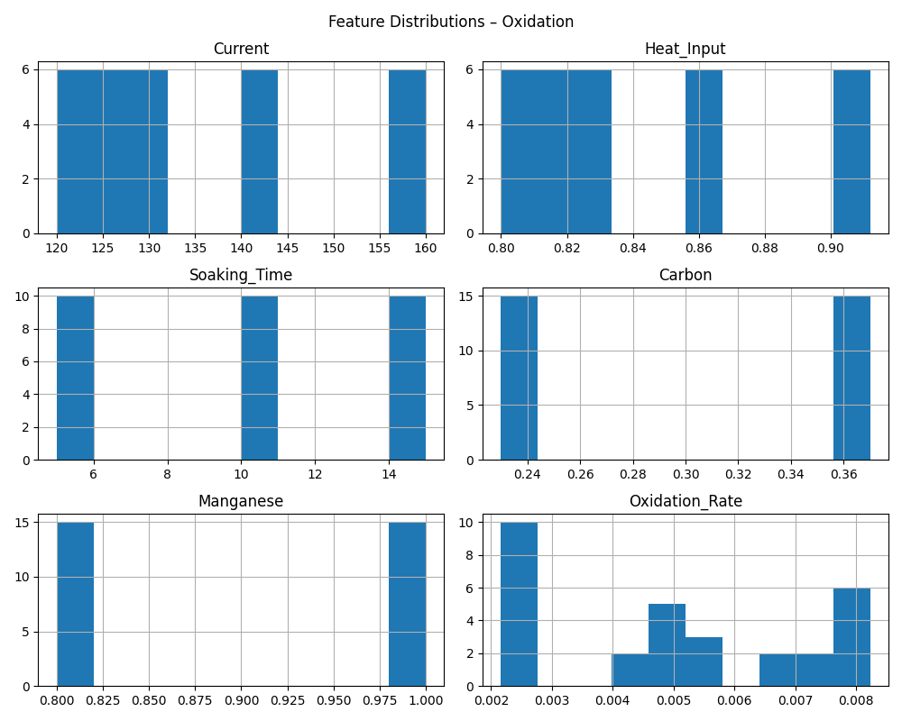

</details>

---
## 📈 Model Performance & Diagnostics
<details>
<summary><strong>Expand Performance Visuals</strong></summary>

### Hardness Model
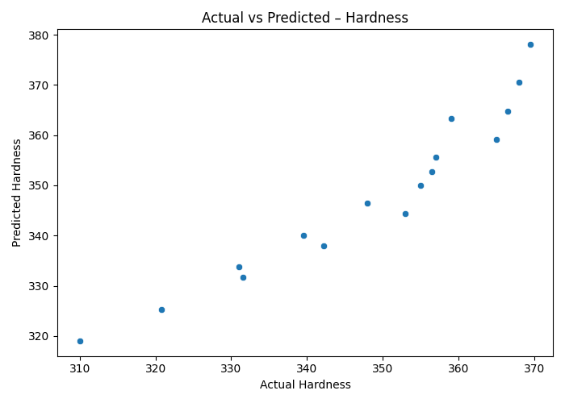
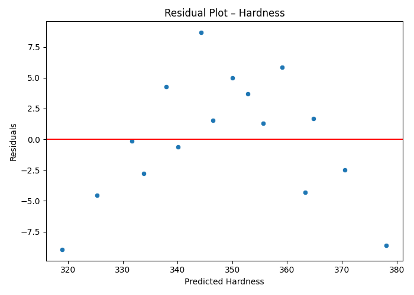
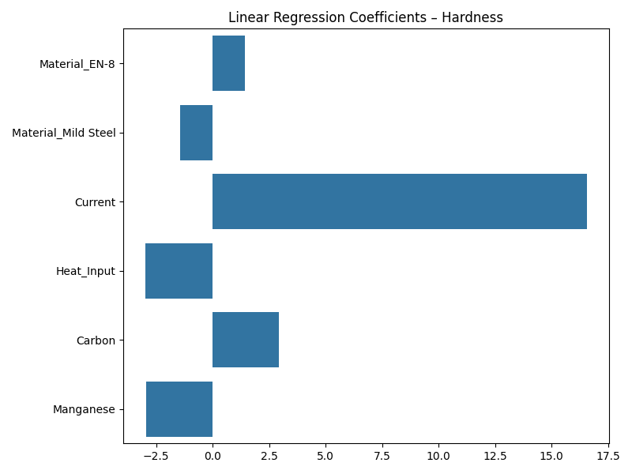

### Oxidation Model
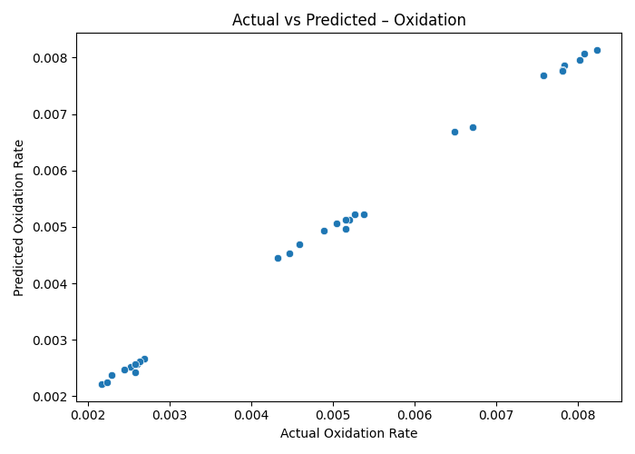
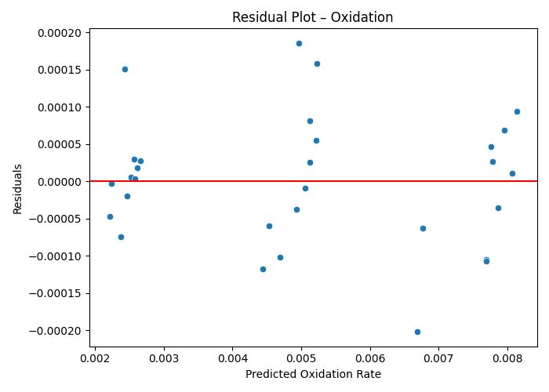
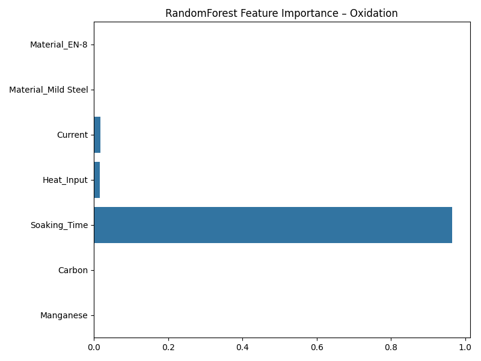

</details>

---

# 🧠 Machine Learning Pipelines

### Feature Engineering
- Normalization  
- Heat-input derived metrics  
- Composition scaling  
- Outlier control  

### Models  
| Task | Algorithms |
|------|------------|
| Hardness | Linear Regression, Random Forest |
| Oxidation | Random Forest |

### Explainability  
- Global SHAP  
- Local SHAP  
- Sensitivity analysis
  
---

# 🧩 Directory Structure  
```
material-hardness-oxidation-prediction/
├── data/
├── models/
├── screenshots/
├── src/
│   ├── app/
│   ├── inference/
│   ├── models/
│   └── utils/
├── tests/
├── requirements.txt
├── render.yaml
├── Procfile
└── runtime.txt
```

---

# 🔧 Local Development

### 1. Clone Repo  
```bash
git clone https://github.com/TheComputationalCore/Material-Hardness-Oxidation-Prediction
cd Material-Hardness-Oxidation-Prediction
```

### 2. Create Environment  
```bash
conda create -n mhoc python=3.10
conda activate mhoc
```
_or:_
```bash
python3 -m venv mhoc
source mhoc/bin/activate
```

### 3. Install Requirements  
```bash
pip install -r requirements.txt
```

### 4. Run Application  
```bash
python src/app/app.py
```

Local server: 
👉 http://localhost:5000

---

# 🚀 Deployment (Render)

### Build  
```
pip install -r requirements.txt
```

### Start  
```
gunicorn "app.app:app" --chdir src --bind 0.0.0.0:$PORT --workers 2
```

---

# 🧪 Testing  
```bash
pytest -q
```

---

# 📘 Documentation  
- docs/MODEL_CARD.md  
- docs/ARCHITECTURE.md  
- docs/API_REFERENCE.md  

---

# 🧾 Citation  
```
D. Chandra et al.,
"Experimental Studies of Stellite-6 Hardfaced Layer on Ferrous Materials by TIG Surfacing Process,"
IOP Conference Series: Materials Science and Engineering,
Vol. 998, 012061, 2020.
doi:10.1088/1757-899X/998/1/012061
```

---

# 👤 Author  
**Dinesh Chandra — TheComputationalCore**

---

# 🔒 License  
MIT License
